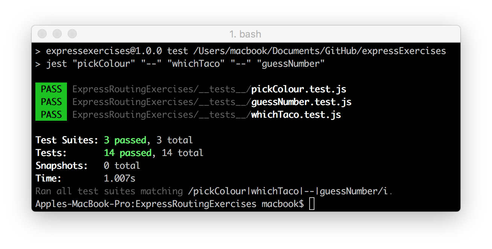
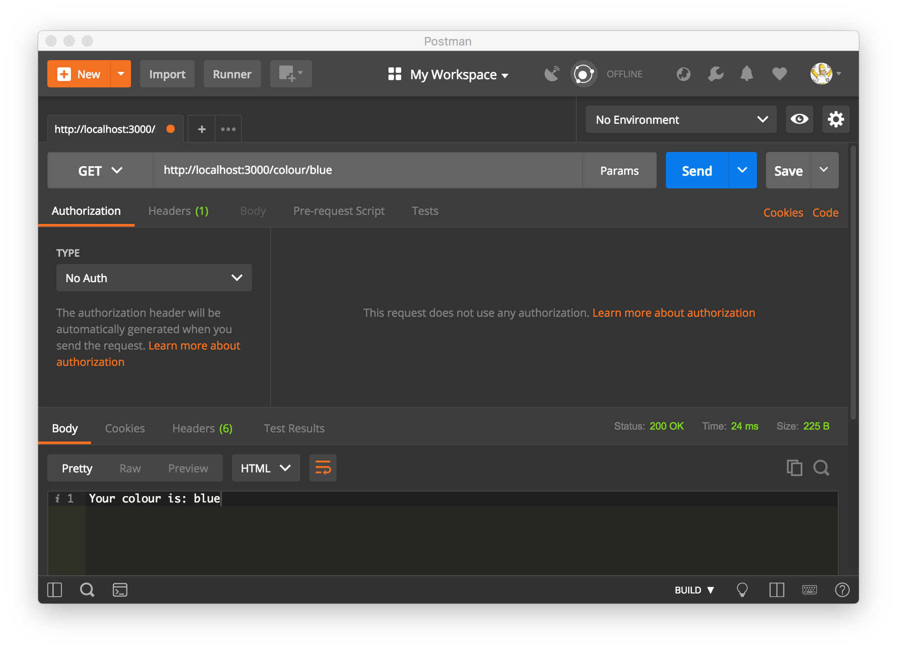
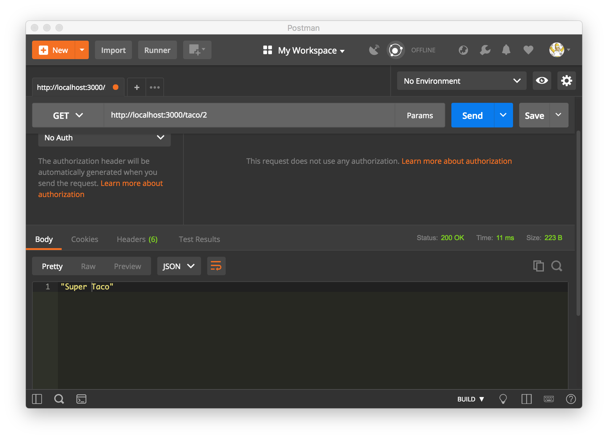
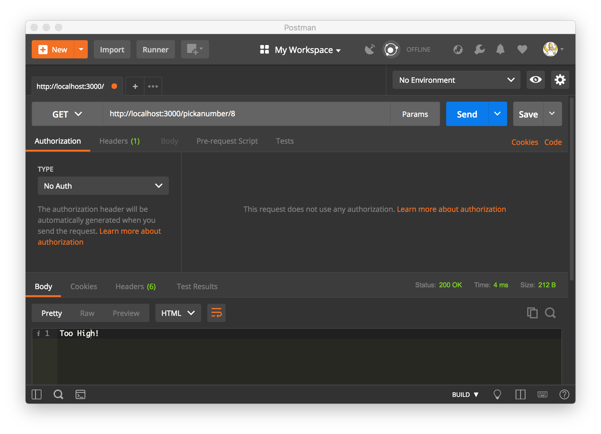

## Express Routing Exercises
___use routing parameters, where each route is a combination of a Request Type and Path.___


## Built with
* [npm](https://www.npmjs.com/) - Node Package Manager
* [Jest](https://facebook.github.io/jest/) - JavaScript Testing Framework
* [Express](https://expressjs.com/) - Server-side JavaScript Framework
* [Postman](https://www.getpostman.com/) - Tool for Testing API

### Pick A Colour
Create a route that responds with "You picked: blue" or "You picked: green" depending on the path. For instance, if I visit: `localhost:3000/pick-a-color/orange` I should see the the colour I chose (orange) named in the response.

<details>
<summary>Solution - Pick A Colour</summary>
<p>

The following solutions assume that the following boiler-plate is present in the `index.js` server code:
``` javascript
// BOILER PLATE
const express = require('express');

const app = express();

// SOLUTION HERE
app.get('/colour/:choice', function(req, res){
  const choice = req.params.choice;
  res.send(`Your colour is: ${choice}`);
});

// BOILER PLATE
const port = 3000;
app.listen(port, () => {
  console.log(`Server Running at localhost: ${port}`);
});
```



</p>
</details>

---

### Which Taco (Indexing a Collection)
Hardcode some data in index.js:
``` javascript

var burgers = [
                "Hamburger",
                "Cheese Burger",
                "Dble Cheese Burger"
               ];

var tacos = [
                "Soft Taco",
                "Crunchy Taco",
                "Super Taco"
               ];
```
* Write a route that will allow you to access a `taco` by it's index in the array, such that one could go to the route: "/taco/2" and get back a server response with the text "Super Taco".
* Write a route that will allow you to access a `burger` by it's index in the array, similar to above.

<details>
<summary>Solution - Which Taco</summary>
<p>

### Which Taco -- Indexing a Collection

The following solutions assume that the following boiler-plate is present in the `index.js` server code:
``` javascript
// BOILER PLATE
const express = require('express');

const app = express();

// SOLUTION HERE
const burgers = [
  'Hamburger',
  'Cheese Burger',
  'Dble Cheese Burger',
];
const tacos = [
  'Soft Taco',
  'Crunchy Taco',
  'Super Taco',
];
app.get('/taco/:index', (req, res) => {
  const index = req.params.index;
  const selection = tacos[index] || "Sorry, that's not a taco option";
  res.json(selection);
});
app.get('/burger/:index', (req, res) => {
  const index = req.params.index;
  const selection = burgers[index] || "Sorry, that's not a burger option";
  res.json(selection);
});

// BOILER PLATE
const port = 3000;
app.listen(port, () => {
  console.log(`Server Running at localhost: ${port}`);
});
```



</p>
</details>

---

### The Number Guessing Game
Build a simple number guessing game using query parameters.
``` javascript
app.get("/pickanumber", function (req, res) {
    var number = req.query.number;
    if (number === 7) {
        res.send("You picked " + number + "!");
    }
});
```
When the user goes to `/pickanumber?number=10` the server should respond with either "Too High", "Too Low" or "Nailed it!"

<details>
<summary>Solution - The Number Guessing Game</summary>
<p>

The following solutions assume that the following boiler-plate is present in the `index.js` server code:
``` javascript
// BOILER PLATE
const express = require('express');

const app = express();

// SOLUTION HERE
const correctNumber = 7;

app.get('/pickanumber/:num', (req, res) => {
  let num = req.params.num;
  if (num === correctNumber) {
    res.send('Nailed it!');
  } else if (num > correctNumber) {
    res.send('Too High!');
  } else {
    res.send('Too Low');
  }
});

// BOILER PLATE
const port = 3000;
app.listen(port, () => {
  console.log(`Server Running at localhost: ${port}`);
});
```



</p>
</details>

---
